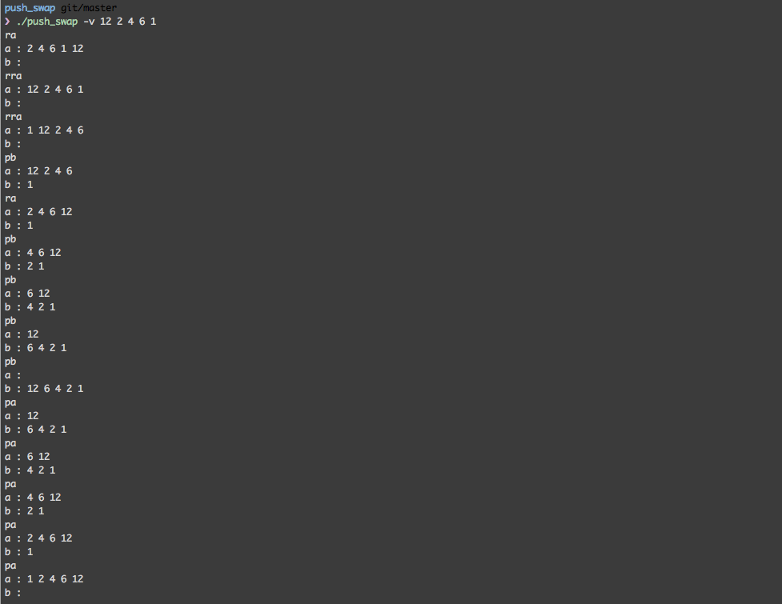

# push_swap

Ce programme a pour but de trier une liste de chiffres dans l'ordre croissant à l'aide de deux piles.

##compiler le programme

dans le dossier du projet :
```
make
```

##executer le programme
```
./push_swap -v 12 2 4 6 1
```


